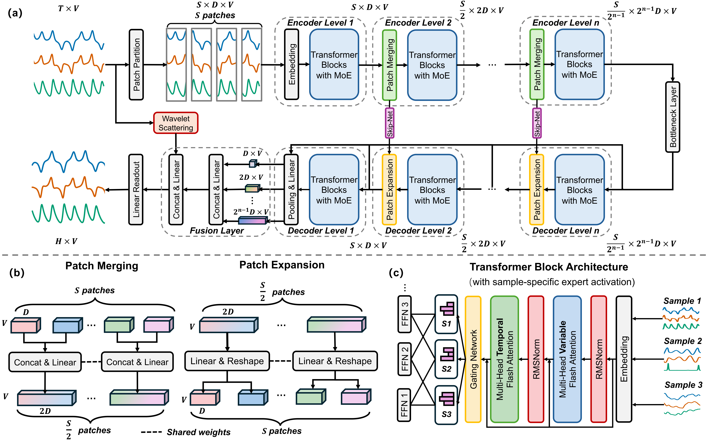

# ChaosNexus

ChaosNexus: A Foundation Model for Universal Chaotic System Forecasting with Multi-scale Representations

Paper abstract:

>"Accurately forecasting chaotic systems, prevalent in domains such as weather prediction and fluid dynamics, remains a significant scientific challenge. The inherent sensitivity of these systems to initial conditions, coupled with a scarcity of observational data, severely constrains traditional modeling approaches. Since these models are typically trained for a specific system, they lack the generalization capacity necessary for real-world applications, which demand robust zero-shot or few-shot forecasting on novel or data-limited scenarios.
To overcome this generalization barrier, we propose ChaosNexus, a foundation model pre-trained on a diverse corpus of chaotic dynamics. ChaosNexus employs a novel multi-scale architecture named ScaleFormer augmented with Mixture-of-Experts layers, to capture both universal patterns and system-specific behaviors. The model demonstrates state-of-the-art zero-shot generalization across both synthetic and real-world benchmarks. On a large-scale testbed comprising over 9,000 synthetic chaotic systems, it improves the fidelity of long-term attractor statistics by more than 40\% compared to the leading baseline. This robust performance extends to real-world applications with exceptional data efficiency. For instance, in 5-day global weather forecasting, ChaosNexus achieves a competitive zero-shot mean error below 1°C—a result that further improves with few-shot fine-tuning. Moreover, experiments on the scaling behavior of ChaosNexus provide a guiding principle for scientific foundation models: cross-system generalization stems from the diversity of training systems, rather than sheer data volume."

# Our Model


# Installation
## Environment
- Tested OS: Linux
- Python 3.11.0
- PyTorch 2.2.1+cu121

# Dataset

Obtain the released datasets from [[Baidu Drive]](https://pan.baidu.com/s/1YvWxKLFLXjzEtK29HK1Vqg?pwd=vjr8), Then place the downloaded data in the folder`./data`.

# Training

```
bash ./scripts/patchtst/run_predict_finetune.sh
```

# Evaluation

```
bash ./scripts/patchtst/run_eval.sh
```

# License
The software in this repository is freely available under MIT license. Please see the license for further details.
